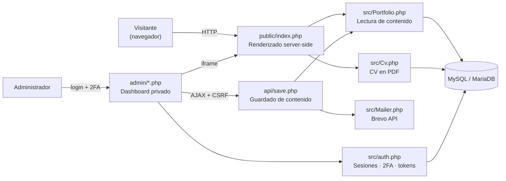
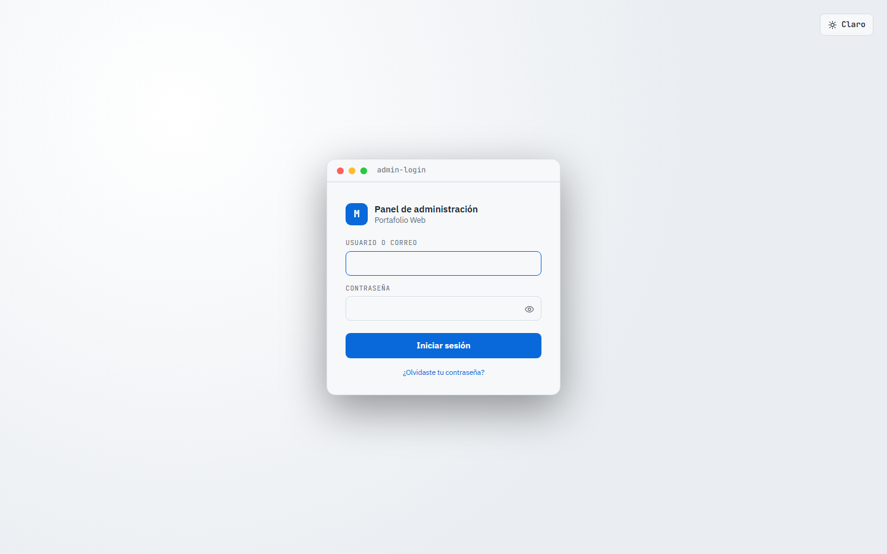
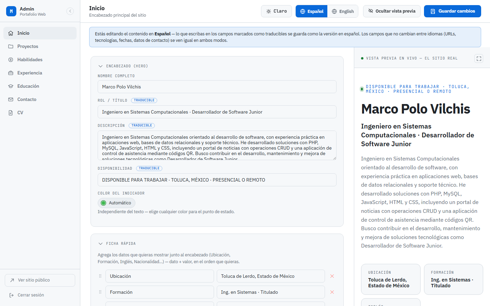
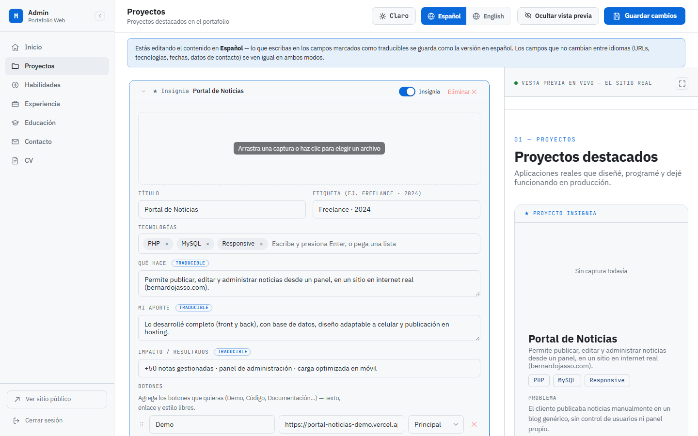
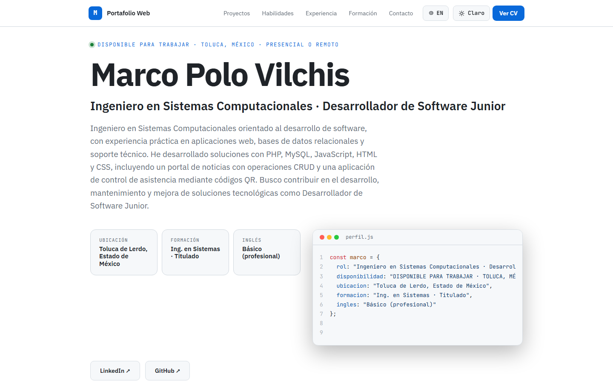
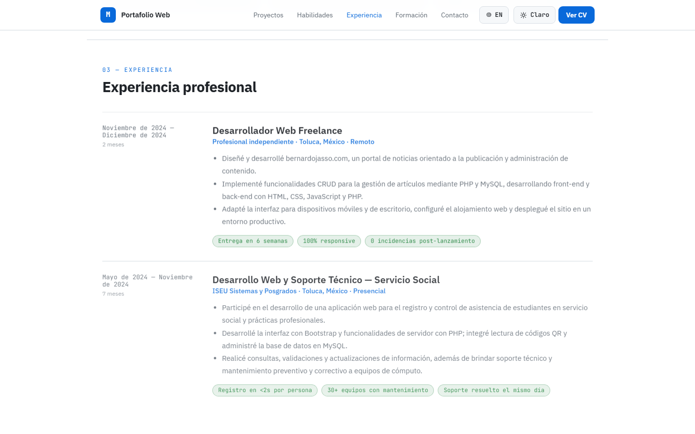
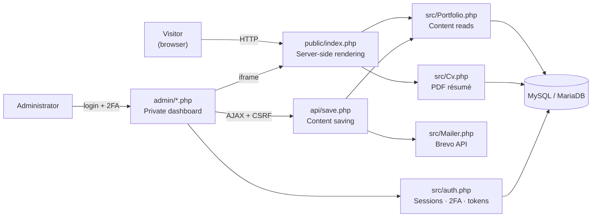

# Portafolio Web · Portfolio Website — Marco Polo Vilchis

<p align="left">
  
  
  
  
</p>

Portafolio profesional con un dashboard de administración privado: todo el contenido del sitio público (hero, proyectos, habilidades, experiencia, educación, certificaciones, contacto, redes sociales, CV) se edita desde el dashboard y se refleja de inmediato en el sitio público y en el CV descargable — sin texto duplicado ni hardcodeado.

Professional portfolio site with a private admin dashboard: all public-site content (hero, projects, skills, experience, education, certifications, contact, social links, résumé) is edited from the dashboard and reflects instantly on the public site and the downloadable résumé — no duplicated or hardcoded text.

**🇪🇸 [Español](#español-1)** · **🇬🇧 [English](#english-1)**

> **Nota de portafolio / Portfolio note:** este repositorio es la versión pública de mi propio sitio personal. El contenido (nombre, proyectos, experiencia, contacto) es real; lo único que no se sube es configuración local sensible (`.env` con credenciales de base de datos/correo) — ver [Seguridad](#seguridad). // This repository is the public version of my own personal site. The content (name, projects, experience, contact info) is real; the only thing excluded is sensitive local configuration (`.env` with database/mail credentials) — see [Security](#implemented-security-1).

---

## Tabla de contenido / Table of contents

- [Español](#español-1)
  - [Descripción](#descripción)
  - [Arquitectura](#arquitectura)
  - [Tecnologías](#tecnologías)
  - [Funcionalidades](#funcionalidades)
  - [Estructura del proyecto](#estructura-del-proyecto)
  - [Instalación (XAMPP)](#instalación-xampp)
  - [Variables de entorno](#variables-de-entorno)
  - [Uso del dashboard](#uso-del-dashboard)
  - [Seguridad](#seguridad)
  - [Rendimiento](#rendimiento)
  - [Capturas de pantalla](#capturas-de-pantalla)
  - [Verificación y pruebas](#verificación-y-pruebas)
  - [Problemas comunes](#problemas-comunes)
  - [Limitaciones conocidas](#limitaciones-conocidas)
  - [Posibles mejoras futuras](#posibles-mejoras-futuras)
- [English](#english-1)
  - [Description](#description)
  - [Architecture](#architecture)
  - [Tech stack](#tech-stack)
  - [Features](#features)
  - [Project structure](#project-structure)
  - [Installation (XAMPP)](#installation-xampp)
  - [Environment variables](#environment-variables)
  - [Using the dashboard](#using-the-dashboard)
  - [Implemented security](#implemented-security-1)
  - [Performance](#performance)
  - [Screenshots](#screenshots-1)
  - [Verification and testing](#verification-and-testing)
  - [Troubleshooting](#troubleshooting)
  - [Known limitations](#known-limitations)
  - [Roadmap](#roadmap)
- [Licencia / License](#licencia--license)

---

## Español

### Descripción

Sitio de portafolio de un solo administrador (no multiusuario, por diseño), pensado para que una sola persona mantenga su propio contenido profesional sin depender de un CMS de terceros. El backend es PHP 8 puro con PDO, sin framework, sin Composer y sin paso de build: los archivos se sirven tal cual desde Apache.

**[Ver capturas de pantalla](#capturas-de-pantalla)** · **[Instalación](#instalación-xampp)** · **[Seguridad](#seguridad)**

### Arquitectura

Arquitectura simple en capas, sin framework: rutas PHP planas, una capa de
lógica en `src/`, y persistencia en MySQL/MariaDB vía PDO.



| Módulo | Responsabilidad |
|---|---|
| `public/index.php` | Renderiza el sitio público completo server-side desde la base de datos. |
| `admin/*.php` | Dashboard privado: login, verificación de correo, setup, recuperación de contraseña, edición de contenido. |
| `api/*.php` | Endpoints JSON usados por el dashboard: `save.php` (guardado con CSRF), `upload-image.php` (subida de imágenes) — ambos con límite de solicitudes por IP además de CSRF. |
| `src/Portfolio.php` | Lógica de lectura/escritura del contenido del portafolio. |
| `src/auth.php` | Autenticación: login en dos pasos, sesiones, tokens de verificación/recuperación. |
| `src/Mailer.php` | Envío de correos transaccionales vía la API HTTP de Brevo. |
| `src/Cv.php` | Genera el CV en PDF a partir de los mismos datos del dashboard. |
| `src/db.php` | Conexión PDO a MySQL/MariaDB. |
| `src/config.php` | Carga de variables de entorno (`.env`). |

### Tecnologías

| Tecnología | Rol en el proyecto | Por qué se eligió |
|---|---|---|
| **PHP 8** | Backend puro, sin framework. | Se sirve nativamente en cualquier hosting compartido/XAMPP sin paso de build ni dependencias que instalar — encaja con un proyecto de un solo administrador donde no hace falta la estructura de un framework completo. |
| **PDO** | Acceso a base de datos con sentencias preparadas. | Evita SQL injection sin depender de un ORM, y es agnóstico de motor (MySQL/MariaDB) si algún día cambia el hosting. |
| **MySQL / MariaDB** | Persistencia de todo el contenido del portafolio. | Disponible por defecto en prácticamente cualquier hosting compartido y en XAMPP; suficiente para el volumen de datos de un portafolio personal. |
| **HTML + CSS + JavaScript vanilla** | Frontend del sitio público y del dashboard. | Sin bundler ni dependencias de Node que instalar/actualizar; los archivos se sirven tal cual, lo que simplifica el despliegue en hosting gratuito. |
| **[Brevo](https://www.brevo.com)** (API HTTP) | Envío de correos transaccionales (verificación, 2FA, recuperación de contraseña). | Muchos hosts gratuitos bloquean los puertos SMTP salientes, pero nunca el puerto 443/HTTPS que usa esta API — así el envío de correo funciona igual en local que en un hosting gratuito real. |
| **Variables de entorno (`.env`)** | Separación de configuración/secretos del código. | Permite subir el código fuente completo a un repositorio público sin exponer credenciales de base de datos ni API keys. |
| **Playwright + Python** (solo pruebas, `tests/e2e/`) | Pruebas end-to-end contra un navegador real: login en dos pasos, recuperación de contraseña, CRUD del dashboard, accesibilidad por teclado, responsive y XSS. | No agrega ninguna dependencia al sitio en producción — vive fuera de `public/`/`admin/`/`api/`, solo se usa para verificar el proyecto durante el desarrollo. |

No hay paso de build ni bundler: los archivos se sirven tal cual desde
Apache, exactamente como están en el repositorio.

### Funcionalidades

#### Sitio público (`public/`)
- Hero, proyectos (con tarjeta "insignia" ampliada), habilidades, experiencia,
  educación, certificaciones, contacto y overlay de CV — todo renderizado
  server-side desde la base de datos.
- **Selector ES/EN** con detección automática por navegador en la primera
  visita, y un fundido (fade) suave al cambiar de idioma con el botón —
  respeta `prefers-reduced-motion`. No se anima al cargar la página, solo al
  hacer clic.
- **Tema claro/oscuro** persistente, con detección de `prefers-color-scheme`
  en la primera visita y una transición tipo fade al alternarlo (sin
  parpadeo al cargar la página).
- **Menú de navegación colapsable en celular** (≤760px, `nav-menu.js`): el
  nav se reduce a marca + botón hamburguesa en vez de envolver los links en
  varias filas; progressive enhancement (`.has-js`, ver más abajo) — sin
  JavaScript el nav se muestra completo, exactamente como antes.
- **Links de redes sociales dinámicos**: se agregan/quitan desde el
  dashboard (no hay un límite fijo de plataformas); el ícono y la etiqueta de
  cada uno se detectan automáticamente por dominio (LinkedIn, GitHub, X,
  Instagram, Facebook, YouTube, WhatsApp, Telegram, TikTok, Dribbble, o un
  ícono genérico de enlace para cualquier otro dominio).
- **Experiencia y certificaciones siempre en orden cronológico** (más
  reciente primero), calculado automáticamente a partir de una fecha real
  capturada en el dashboard — no depende del orden en que se guardaron.
- **CV auto-generado** (`src/Cv.php`): mismo formato que un CV real, 100%
  generado a partir de los datos del dashboard, descargable en PDF.
- **Lightbox al hacer clic en la imagen de un proyecto** (insignia o tarjeta
  normal): overlay compartido con Escape, trampa de foco y devolución del
  foco a quien lo abrió — mismo patrón de accesibilidad que el overlay del
  CV.
- **Insignia de disponibilidad** (Inicio y Contacto), con texto y color
  editables desde el dashboard — ej. "Disponible para nuevos proyectos" con
  un punto verde, o el color/texto que elijas.
- **Efecto "código" tipo máquina de escribir** en el Hero: la Ficha rápida
  (ubicación, nivel de inglés, etc.) se muestra también como un objeto de
  código falso que se "escribe" solo — las claves se generan automáticamente
  a partir de la etiqueta de cada dato, sin nada hardcodeado.
- **Resaltado del link activo del nav al hacer scroll** y **aparición suave
  de cada sección** al entrar en pantalla — ambos respetan
  `prefers-reduced-motion`.

#### Dashboard (`admin/`)
- Edición de todo el contenido vía formularios que guardan por AJAX
  (`api/save.php`), protegidos con CSRF.
- Vista previa en vivo del sitio público (redimensionable, colapsable y
  ampliable a pantalla completa); al ocultarla, el formulario aprovecha el
  espacio liberado en vez de dejarlo vacío. La vista previa oculta el
  header/nav del sitio (no aporta nada dentro del panel). Al enfocar un
  campo (proyecto, habilidad, experiencia, certificación) se resalta con un
  contorno la tarjeta correspondiente dentro de la vista previa, para ubicar
  de un vistazo qué se está editando.
- Barra lateral colapsable a solo-iconos; las tarjetas fijas del panel
  (Encabezado, Ficha rápida, Redes sociales, Idiomas, Certificaciones,
  Contacto, Disponibilidad, CV) también son plegables individualmente.
- Arrastrar para reordenar proyectos y categorías de habilidades. Experiencia
  y certificaciones **no** se arrastran — su orden es automático por fecha
  (ver arriba).
- Entrada de "chips" para tecnologías, métricas y redes sociales: escribe y
  presiona Enter (o pega una lista/URL), con detección de duplicados.
- **Niveles de habilidad totalmente personalizables**: ya no son 5 presets
  fijos por código — escribe cualquier etiqueta propia (con autocompletado
  de las que ya usaste) y elige su color.
- **Selector de color** para la insignia de disponibilidad y el color de
  cada nivel de habilidad: un clic aplica el color de inmediato, y otro
  clic en la × regresa a "automático" (el color por defecto, que sigue el
  tema claro/oscuro) sin perder el último tono elegido.
- **Recuperación de borrador**: si cerrás la pestaña o se cae el navegador
  con cambios sin guardar, la próxima vez que entrés al dashboard aparece un
  aviso para restaurarlos o descartarlos — nunca se sobreescribe el
  formulario en silencio, y el borrador se guarda solo en tu navegador
  (`localStorage`), nunca en el servidor.
- **Confirmación de eliminación** con un modal propio animado (no el
  `window.confirm()` nativo del navegador) antes de borrar cualquier
  proyecto, habilidad, experiencia o certificación.
- Avisos de "guardando…"/éxito/error como toasts, consistentes con el resto
  de la interfaz — nunca `alert()`.

#### Bilingüe manual
Cada campo narrativo tiene su columna `_en` en la base de datos; el
dashboard tiene un selector "Editando: Español/English" para capturar ambas
versiones. El botón ES/EN del sitio solo muestra la que corresponda — no hay
traducción automática por IA ni por API externa.

### Estructura del proyecto

```text
portafolio-marco/
├── public/          → sitio público (index.php + assets/css, assets/js, uploads)
├── admin/           → dashboard privado (login, verify, verify-email, setup,
│                      index, forgot/reset-password) + assets/css, assets/js
├── api/             → endpoints JSON que usa el dashboard (save.php, upload-image.php),
│                      cada uno con su .htaccess propio (defensa adicional)
├── src/             → lógica: auth.php, Mailer.php, Portfolio.php, Cv.php, db.php,
│                      helpers.php, config.php, logs/ (bitácora de seguridad,
│                      no servible por HTTP)
├── database/        → schema.sql (estructura) + seed.sql (contenido de ejemplo) +
│                      migrations/ (cambios incrementales para una BD ya existente;
│                      schema.sql ya los incluye todos para una instalación nueva)
├── i18n/            → es.json / en.json (textos fijos de la interfaz pública)
├── screenshots/     → capturas usadas en este README
├── tests/e2e/       → pruebas end-to-end con Playwright + Python (ver tests/e2e/README.md)
├── .env.example     → plantilla de variables de entorno (copiar a .env)
└── .htaccess        → sirve public/ en la raíz del dominio + cabeceras de
                       seguridad + bloqueo de dotfiles
```

### Instalación (XAMPP)

**Requisitos:** PHP 8.0+, MySQL/MariaDB, Apache con `mod_rewrite`/`mod_headers`
(cualquier instalación estándar de XAMPP los trae).

1. Clona el repositorio dentro de `htdocs/` (ej. `C:\xampp\htdocs\`):
   ```bash
   git clone https://github.com/Marco2004/portafolio-marco-portfolio-marco.git
   cd portafolio-marco-portfolio-marco
   ```
   También puedes descargar el `.zip` desde GitHub (botón `Code` → `Download ZIP`) y descomprimirlo dentro de `htdocs/` si no tienes Git instalado.
2. Crea la base de datos e impórtala:
   ```bash
   mysql -u root -e "CREATE DATABASE portafolio"
   mysql -u root portafolio < database/schema.sql
   mysql -u root portafolio < database/seed.sql   # opcional, contenido de ejemplo
   ```
3. Copia `.env.example` a `.env` y rellena tus propios valores (ver
   [Variables de entorno](#variables-de-entorno) abajo). `.env` nunca se sube
   a git y el `.htaccess` de la raíz bloquea su descarga por HTTP.
4. Abre `http://localhost/portafolio-marco/admin/setup.php` para crear la
   única cuenta de administrador (el formulario desaparece en cuanto existe
   una cuenta). Vas a necesitar confirmar tu correo antes de poder iniciar
   sesión — revisa tu bandeja de entrada.
5. Sitio público: `http://localhost/portafolio-marco/public/index.php`.
   Dashboard: `http://localhost/portafolio-marco/admin/login.php`.

No hay paso de build ni comandos de compilación — los archivos se sirven tal
cual desde Apache.

En producción (dominio real, `mod_rewrite` activo), el `.htaccess` de la raíz
sirve el sitio público directamente en `https://midominio.com/` — no hace
falta escribir `/public` en la URL (`https://midominio.com/public/index.php`
sigue funcionando igual, es la misma página). En XAMPP local, dentro de una
subcarpeta de `htdocs`, seguí usando la ruta con `/public/` como en el paso 5
(la reescritura asume que el proyecto vive en la raíz del document root).

**Instalación en un vistazo**

```text
git clone ...            → descarga el código
CREATE DATABASE + schema → crea la estructura de la base de datos
copy .env.example .env   → crea tu configuración local privada
editar .env               → define DB_*, BREVO_API_KEY, ADMIN_ACCESS_KEY...
admin/setup.php           → crea la única cuenta de administrador
admin/login.php            → dashboard listo para editar contenido
public/index.php           → sitio público en vivo
```

### Variables de entorno

Definidas en `.env` (ver `.env.example`), leídas por `src/config.php`:

| Variable | Descripción | Default si falta |
|---|---|---|
| `DB_HOST` | Host de MySQL | `127.0.0.1` |
| `DB_NAME` | Nombre de la base de datos | `portafolio` |
| `DB_USER` | Usuario de MySQL | `root` |
| `DB_PASS` | Contraseña de MySQL | *(vacío)* |
| `BREVO_API_KEY` | API key de [Brevo](https://www.brevo.com) (plan gratuito: 300 correos/día, sin tarjeta) — Panel > SMTP & API > API Keys | *(sin default, requerido para enviar correo)* |
| `MAIL_FROM_EMAIL` | Correo remitente — debe ser el que verificaste en Brevo como "remitente individual" | *(sin default, requerido para enviar correo)* |
| `MAIL_FROM_NAME` | Nombre visible del remitente | igual que `SITE_NAME` |
| `SITE_NAME` | Nombre del sitio, usado en correos y `<title>` | `Portafolio Web` |
| `SITE_URL` | Dominio público real (sin `/` final, ej. `https://midominio.com`), usado para armar los links de recuperación de contraseña/verificación de correo | *(vacío → usa el Host de la petición, solo pensado para desarrollo local)* |
| `ADMIN_ACCESS_KEY` | Clave secreta para poder abrir `/admin` (ver [Seguridad](#seguridad)) — genera la tuya con `php -r "echo bin2hex(random_bytes(20));"` | *(vacío → `/admin` no está protegido por clave, solo pensado para desarrollo local)* |

Sin `BREVO_API_KEY`/`MAIL_FROM_EMAIL` configurados, el sitio funciona con
normalidad pero ningún correo (verificación de cuenta, códigos de acceso,
recuperación de contraseña) podrá enviarse — necesarios para poder iniciar
sesión. El correo se manda vía la API HTTP de Brevo en vez de SMTP para que
funcione igual en hosts gratuitos que bloquean puertos SMTP salientes (ver
[Tecnologías](#tecnologías)). El plan gratuito de Brevo agrega un pequeño pie de página
"Sent with Brevo" a cada correo — informativo, no es un error.

### Uso del dashboard

0. **En producción**: si configuraste `ADMIN_ACCESS_KEY` (ver
   [Variables de entorno](#variables-de-entorno)), la primera vez tenés que
   abrir `https://midominio.com/admin/login.php?key=TU_CLAVE`. Desde ahí una
   cookie de un año recuerda el navegador — no hace falta repetir la clave en
   cada visita, y cualquiera que entre a `/admin` sin ella recibe un 404 liso,
   como si el panel no existiera.
1. **Primer arranque**: `admin/setup.php` crea la única cuenta — el
   formulario incluye un medidor de fortaleza de contraseña propio (niveles
   de "Muy débil" a "Muy fuerte", con la política real aplicada también en
   el servidor).
2. **Verificación de correo**: tras crear la cuenta, se envía un enlace de
   confirmación — el login queda bloqueado hasta confirmarlo.
3. **Login en dos pasos**: usuario o correo + contraseña, luego un código de
   6 dígitos enviado por correo (con opción de "recordar este dispositivo"
   por 30 días). Cada inicio de sesión exitoso también notifica por correo.
4. **Editar contenido**: cada pestaña de la barra lateral corresponde a una
   sección del sitio público. Los cambios se guardan hasta presionar
   "Guardar cambios" — antes de eso solo viven en el navegador (con un
   borrador automático en `localStorage` por si se recarga la página sin
   querer).
5. **Vista previa en vivo**: el panel de la derecha es el sitio real
   cargado en un iframe, sincronizado en cada cambio sin necesidad de
   guardar primero.

### Seguridad

- **Sin secretos en el código versionado**: credenciales de BD y la API key
  de Brevo viven en `.env` (ignorado por git), nunca en `src/config.php`.
- **`/admin` oculto tras una clave secreta** (`ADMIN_ACCESS_KEY` en `.env`,
  ver [Uso del dashboard](#uso-del-dashboard)): sin ella, cualquier URL bajo
  `/admin/` responde 404 como si no existiera — pensado contra bots/escáneres
  que prueban `/admin/login.php` a ciegas, no reemplaza el login real
  (contraseña + 2FA) sino que se suma encima. Los links de verificación de
  correo/recuperación de contraseña no pasan por esta clave: su propio token
  de un solo uso ya cumple ese papel.
- **`.htaccess` bloquea el acceso HTTP directo** a cualquier dotfile
  (`.env`, `.gitignore`, etc.), a `database/*.sql`, a `src/*.php` y al log de
  seguridad — solo Apache/PHP internamente pueden leerlos. `admin/` y `api/`
  también tienen su propio `.htaccess` (deshabilita listar directorios y
  bloquea extensiones de respaldo/editor sueltas) como segunda capa,
  independiente de la de la raíz.
- **Límite de solicitudes por IP también en `api/save.php` y
  `api/upload-image.php`** (además de CSRF + sesión activa), para que una
  sesión comprometida no pueda usarse para golpear la base de datos o subir
  archivos sin freno — mismo mecanismo que ya protegía login/reset/verify.
  `api/save.php` también pone un techo al tamaño de las listas que acepta
  (proyectos, habilidades, experiencia, etc.) por la misma razón.
- **El cookie de la reja de `/admin` (`ADMIN_ACCESS_KEY`) ya funciona también
  en instalaciones dentro de una subcarpeta** (ej. XAMPP local en
  `htdocs/portafolio-marco/`), no solo en la raíz del dominio — antes su
  ruta venía fija a `/admin/`, lo que en una subcarpeta hacía que el
  navegador nunca lo reenviara una vez que la sesión expiraba o se cerraba
  sesión, obligando a repetir la clave por URL en cada visita. Además, la
  clave se quita de la URL con un redirect apenas se guarda el cookie —
  sigue quedando en el log del servidor de esa primera visita (inevitable),
  pero ya no persiste en la barra de direcciones ni viaja en el header
  `Referer` de lo que esa página cargue después.
- **Límite de solicitudes por IP también en el login y en la verificación
  del código de dos pasos** (`admin/login.php`, acción "verify" de
  `admin/verify.php`), sumado al bloqueo ya existente por cuenta tras varios
  intentos fallidos — ese bloqueo es por cuenta, así que no frenaba a quien
  probara muchos usuarios/correos distintos desde la misma conexión, ni a
  quien pidiera muchos códigos nuevos para volver a intentar 5 veces cada uno.
- **Cerrar sesión ahora exige CSRF** (formulario con token, no un simple
  `<a href="logout.php">`) — antes cualquier página externa podía forzar el
  cierre de sesión del admin con solo hacer que su navegador pidiera esa URL
  (impacto bajo, una desconexión forzada, pero sin motivo para dejarlo así).
- **Todo texto libre se recorta al tamaño real de su columna antes de
  guardarlo** (`cap()` en `src/helpers.php`, usado en todo
  `Portfolio::saveAll()`) — antes, un texto más largo que su columna
  dependía de la configuración del servidor de MySQL/MariaDB: algunos lo
  truncaban en silencio sin avisar, otros con `sql_mode` estricto tiraban un
  error fatal y no guardaban nada. Ahora el comportamiento es siempre el
  mismo (se recorta, sin error) sin importar el hosting.
- **Contraseñas**: mínimo 8 caracteres, rechaza contraseñas de una lista
  negra de las más filtradas/reutilizadas, coincidencias con el usuario/correo,
  y patrones triviales (repetidos, secuenciales) — validado en cliente y
  servidor por igual (criterio alineado con NIST 800-63B: longitud y lista
  negra pesan más que exigir combinaciones arbitrarias de símbolos).
- **Verificación de correo obligatoria** antes del primer login (evita
  cuentas creadas con un correo inexistente/ajeno).
- **Login en dos pasos** (contraseña + código de un solo uso por correo),
  bloqueo temporal tras varios intentos fallidos, "recordar dispositivo"
  revocado automáticamente al restablecer la contraseña o cerrar sesión.
- **Recuperación de contraseña**: mensajes explícitos ("ese usuario no
  existe" / "ese correo no está asociado a ninguna cuenta") en vez del
  mensaje ambiguo típico anti-enumeración — decisión consciente para este
  proyecto de un solo administrador, donde esa protección no aporta nada
  (solo existe una cuenta posible) y a cambio dificultaba diagnosticar
  typos; el límite de solicitudes tanto por sesión (cooldown de 60s entre
  envíos) como por IP (5 cada 15 min) sigue aplicando para que no se use
  para sondear identificadores o espamear correos sin freno.
- **CSRF**: token por header en las llamadas AJAX del dashboard, y token de
  campo oculto en los formularios clásicos de autenticación (login, setup,
  forgot-password, reset, verify).
- **Sesiones**: cookies `HttpOnly` + `SameSite=Lax`, regeneración de ID tras
  login, cierre automático por inactividad.
- **Correos con diseño propio y consistente** (verificación, bienvenida,
  código de acceso, recuperación y confirmación de contraseña, aviso de
  nuevo inicio de sesión) — nunca texto plano genérico.
- **Cabeceras HTTP** (`X-Content-Type-Options`, `X-Frame-Options`,
  `Referrer-Policy`, `Permissions-Policy`, `Content-Security-Policy`) vía
  `.htaccess`.
- **Bitácora de seguridad** en `src/logs/security.log` (intentos fallidos,
  bloqueos, altas de cuenta, resets) — nunca registra contraseñas, códigos ni
  tokens en claro.

### Rendimiento

- **Caché de un año en CSS/JS/imágenes/fuentes** vía `.htaccess`
  (`Cache-Control: public, max-age=31536000, immutable`) — seguro porque el
  CSS/JS local siempre se pide con `?v=<fecha de modificación>` (ver
  `asset_url()` en `src/helpers.php`), así que un cambio de archivo cambia
  la URL y el navegador pide la versión nueva sin esperar a que expire nada;
  las imágenes subidas por el admin usan un nombre aleatorio nuevo en cada
  subida, nunca se sobreescribe una existente.
- **Compresión gzip** vía `mod_deflate` — el `.htaccess` ya trae la
  directiva, pero XAMPP no trae ese módulo activado por defecto (viene
  comentado en `httpd.conf`); en la mayoría de hostings compartidos ya está
  activo de fábrica. Ver [Problemas comunes](#problemas-comunes) si querés
  activarlo en tu XAMPP local.
- **`defer` en los scripts del dashboard** (`admin/index.php`): los 21
  módulos JS del panel se descargan en paralelo desde que arranca el parser
  en vez de uno por uno según el HTML los va encontrando — mismo orden de
  ejecución que antes (`defer` respeta el orden del documento), solo cambia
  cuándo empieza la descarga.
- **Índices en las listas que se ordenan** (`sort_order, id` — proyectos,
  habilidades, experiencia, etc., ver `database/migrations/2026_07_23_indexes.sql`
  para una base de datos ya existente, o `database/schema.sql` para una
  instalación nueva) — sin efecto perceptible al tamaño de datos de un
  portafolio personal, pero es la práctica correcta y no cuesta nada
  mantenerla.
- **Imágenes de proyecto con `loading="lazy"` + `decoding="async"`** — no
  bloquean el render inicial ni compiten por ancho de banda con lo que sí
  está en pantalla.

### Capturas de pantalla

| Login | Dashboard — Inicio + vista previa | Dashboard — Proyectos |
|---|---|---|
|  |  |  |

| Portafolio — Hero | Portafolio — Tema claro | Portafolio — Experiencia |
|---|---|---|
|  |  |  |

Más capturas disponibles en [`screenshots/`](screenshots/).

### Verificación y pruebas

El proyecto no tiene framework ni build step, pero sí cuenta con una suite de
pruebas end-to-end en **[`tests/e2e/`](tests/e2e/README.md)** (Playwright +
Python, sin `pytest` — scripts independientes que abren un Chromium real
contra la instancia local) que ejercita, contra el sitio real y su base de
datos:

- Login en dos pasos (contraseña + código OTP por correo), recuperación de
  contraseña (link real por Brevo) y logout (revoca sesión + "recordar
  dispositivo").
- CRUD del dashboard con guardado real ida y vuelta a MySQL, incluida una
  compuerta de seguridad que aborta antes de guardar si un dato de prueba
  temporal no se quitó correctamente primero.
- Accesibilidad: reordenar listas con teclado (flecha arriba/abajo sobre la
  manija de arrastre), elegir una opción del combo de nivel de habilidad con
  Enter, roles/`aria-*` de las pestañas de sección.
- Responsive: sin scroll horizontal en 320/390/768px, objetivos táctiles
  ≥40px en los controles del dashboard, apilado correcto de las filas
  repetibles (habilidades, experiencia, etc.) en móvil.
- QA adversarial: contraseña incorrecta, usuario inexistente (mensaje
  específico — ver nota en [Seguridad](#seguridad)), formulario vacío, y un
  payload de XSS guardado y releído para confirmar que sale escapado (nunca
  se ejecuta) tanto en el propio guardado como en el sitio público.
- Regenera las capturas de [`screenshots/`](screenshots/) usadas en este
  README a partir del sitio real.

Además:

- `php -l` sobre cada archivo tocado antes de dar por buena cualquier
  entrega, para atrapar errores de sintaxis.
- Revisión manual en el navegador del flujo completo, en ambos temas, ambos
  idiomas y al menos un ancho de escritorio y uno de celular.

### Problemas comunes

#### `admin/setup.php` no muestra el formulario

Ya existe una cuenta de administrador (el formulario desaparece
automáticamente en cuanto hay una). Usá `admin/login.php` en su lugar, o si
es una instalación local nueva, revisá que importaste una base de datos
limpia (`database/schema.sql` sin `seed.sql`, o una BD recién creada).

#### No llegan correos (verificación, 2FA, recuperación)

Revisá que `BREVO_API_KEY` y `MAIL_FROM_EMAIL` estén configurados en `.env`
(ver [Variables de entorno](#variables-de-entorno)) y que `MAIL_FROM_EMAIL`
sea exactamente el remitente verificado en tu cuenta de Brevo. Sin estas dos
variables, el sitio funciona con normalidad pero ningún correo puede
enviarse — y sin correo no se puede iniciar sesión (verificación obligatoria).

#### `/admin` responde 404 aunque la ruta es correcta

Si configuraste `ADMIN_ACCESS_KEY` en `.env`, necesitás abrir primero
`/admin/login.php?key=TU_CLAVE` una vez para que el navegador reciba la
cookie que lo recuerda (ver [Uso del dashboard](#uso-del-dashboard)). Es el
comportamiento esperado, no un error.

#### Error CSRF al guardar contenido

Recargá la página del dashboard e intentá de nuevo — el token CSRF expira
con la sesión. Los formularios deben enviarse desde las pantallas del
sistema (no copiando el HTML fuera del dashboard) para incluir el token
correcto.

#### La vista previa en vivo no carga dentro del dashboard

Confirmá que estás accediendo al dashboard por la misma URL/dominio que el
sitio público — la vista previa carga `public/index.php` en un `<iframe>`,
así que un mismatch de host/puerto puede bloquearla.

#### Quiero activar la compresión gzip en mi XAMPP local

El `.htaccess` ya trae la directiva de `mod_deflate` (ver
[Rendimiento](#rendimiento)), pero XAMPP no activa ese módulo por defecto.
Para activarlo: abrí `C:\xampp\apache\conf\httpd.conf`, buscá las líneas
`#LoadModule deflate_module modules/mod_deflate.so`,
`#LoadModule expires_module modules/mod_expires.so` y
`#LoadModule filter_module modules/mod_filter.so` (mod_deflate depende de
mod_filter para que funcione `AddOutputFilterByType` — si activás solo los
dos primeros, Apache tira un error 500 en todo el sitio), quitales el `#`
del inicio a los tres, y reiniciá Apache desde el panel de XAMPP. No es
necesario en la mayoría de hostings reales — casi todos ya traen
`mod_deflate` activo de fábrica.

### Limitaciones conocidas

- Sin build/bundler: los archivos CSS/JS se sirven sin minificar ni
  concatenar (aceptable para el tamaño actual del proyecto).
- Las pruebas end-to-end (`tests/e2e/`) se corren a mano, sin integración
  continua — no hay pipeline que las dispare automáticamente en cada cambio.
- Aplicación de un solo administrador: no hay roles, permisos ni
  multiusuario (es intencional, no una limitación a resolver).
- El Content-Security-Policy permite `'unsafe-inline'` en `style-src`
  (`script-src` ya no lo necesita — todo el JS vive en archivos `.js`
  externos) porque el proyecto usa `style=""` inline calculado en tiempo
  real (fades, arrastrar para reordenar, colores personalizados) en varias
  plantillas — eliminarlo del todo requeriría mover esos valores dinámicos a
  clases CSS fijas.

### Posibles mejoras futuras

Ideas de evolución natural para este proyecto, fuera del alcance actual:

- Pruebas unitarias (PHPUnit) para la capa de lógica (`src/`) e integración
  continua que corra esas pruebas y las de `tests/e2e/` en cada cambio.
- Minificación/concatenación de CSS y JS para producción.
- Endurecer el Content-Security-Policy eliminando el `'unsafe-inline'` que
  todavía queda en `style-src`, moviendo esos valores dinámicos a clases CSS
  fijas (`script-src` ya no lo necesita).
- Exportar el CV también en formatos adicionales (ej. `.docx`).
- Contenedor Docker para instalación reproducible sin depender de XAMPP.

---

## English

### Description

Single-administrator portfolio site (not multiuser, by design), built so one person can maintain their own professional content without depending on a third-party CMS. The backend is plain PHP 8 with PDO — no framework, no Composer, no build step: files are served as-is by Apache.

**[Screenshots](#screenshots-1)** · **[Installation](#installation-xampp)** · **[Security](#implemented-security-1)**

### Architecture

Simple layered architecture, no framework: flat PHP routes, a logic layer in
`src/`, and persistence in MySQL/MariaDB through PDO.



| Module | Responsibility |
|---|---|
| `public/index.php` | Renders the full public site server-side from the database. |
| `admin/*.php` | Private dashboard: login, email verification, setup, password recovery, content editing. |
| `api/*.php` | JSON endpoints used by the dashboard: `save.php` (CSRF-protected saves), `upload-image.php` (image uploads) — both also rate-limited per IP on top of CSRF. |
| `src/Portfolio.php` | Reads/writes the portfolio content. |
| `src/auth.php` | Authentication: two-step login, sessions, verification/recovery tokens. |
| `src/Mailer.php` | Sends transactional email through Brevo's HTTP API. |
| `src/Cv.php` | Generates the PDF résumé from the same dashboard data. |
| `src/db.php` | PDO connection to MySQL/MariaDB. |
| `src/config.php` | Loads environment variables (`.env`). |

### Tech stack

| Technology | Role in the project | Why it was chosen |
|---|---|---|
| **PHP 8** | Plain backend, no framework. | Runs natively on any shared host/XAMPP with no build step or dependencies to install — fits a single-administrator project that doesn't need the structure of a full framework. |
| **PDO** | Database access with prepared statements. | Prevents SQL injection without depending on an ORM, and stays engine-agnostic (MySQL/MariaDB) in case the host changes later. |
| **MySQL / MariaDB** | Persists all portfolio content. | Available by default on virtually any shared host and in XAMPP; enough for the data volume of a personal portfolio. |
| **HTML + CSS + vanilla JavaScript** | Frontend for both the public site and the dashboard. | No bundler or Node dependencies to install/update; files are served as-is, simplifying deployment on free hosting. |
| **[Brevo](https://www.brevo.com)** (HTTP API) | Transactional email (verification, 2FA, password recovery). | Many free hosts block outbound SMTP ports, but never port 443/HTTPS, which this API uses — so mail sending behaves the same locally as on a real free-tier host. |
| **Environment variables (`.env`)** | Keeps config/secrets out of the code. | Lets the full source code live in a public repo without exposing database credentials or API keys. |
| **Playwright + Python** (tests only, `tests/e2e/`) | End-to-end tests against a real browser: two-step login, password recovery, dashboard CRUD, keyboard accessibility, responsive layout, and XSS. | Adds no dependency to the production site — lives outside `public/`/`admin/`/`api/`, only used to verify the project during development. |

No build step or bundler: files are served as-is by Apache, exactly as they
sit in the repository.

### Features

#### Public site (`public/`)
- Hero, projects (with an expanded "flagship" card), skills, experience,
  education, certifications, contact, and a résumé overlay — all rendered
  server-side from the database.
- **ES/EN language switch** with automatic browser-locale detection on the
  first visit, and a smooth fade when switching languages with the button —
  respects `prefers-reduced-motion`. No animation on page load, only on
  click.
- **Persistent light/dark theme**, with `prefers-color-scheme` detection on
  the first visit and a fade-style transition when toggling (no flash on
  page load).
- **Collapsible mobile nav menu** (≤760px, `nav-menu.js`): the nav collapses
  to brand + hamburger button instead of wrapping the links across several
  rows; progressive enhancement (`.has-js`, see below) — without
  JavaScript the nav shows in full, exactly as before.
- **Dynamic social links**: added/removed from the dashboard (no fixed
  platform limit); each icon and label is auto-detected by domain
  (LinkedIn, GitHub, X, Instagram, Facebook, YouTube, WhatsApp, Telegram,
  TikTok, Dribbble, or a generic link icon for any other domain).
- **Experience and certifications always in chronological order** (most
  recent first), computed automatically from a real date captured in the
  dashboard — independent of save order.
- **Auto-generated résumé** (`src/Cv.php`): same format as a real résumé,
  100% generated from the dashboard's data, downloadable as PDF.
- **Lightbox on clicking a project image** (flagship or regular card): a
  shared overlay with Escape, focus trap, and focus returning to whoever
  opened it — same accessibility pattern as the résumé overlay.
- **Availability badge** (Hero and Contact), with editable text and color
  from the dashboard — e.g. "Available for new projects" with a green dot,
  or whatever text/color you choose.
- **Typewriter-style "code" effect** in the Hero: the Quick facts (location,
  English level, etc.) are also shown as a fake code object that "types
  itself out" — the keys are generated automatically from each fact's
  label, nothing hardcoded.
- **Active nav link highlighting on scroll** and a **smooth reveal for each
  section** as it enters the viewport — both respect
  `prefers-reduced-motion`.

#### Dashboard (`admin/`)
- Editing of all content through forms that save via AJAX (`api/save.php`),
  CSRF-protected.
- Live preview of the public site (resizable, collapsible, and expandable
  to full screen); hiding it lets the form reclaim the freed space instead
  of leaving it empty. The preview hides the site's header/nav (adds
  nothing inside the panel). Focusing a field (project, skill, experience
  entry, certification) outlines the matching card inside the preview, so
  you can spot at a glance what you're editing.
- Sidebar collapsible to icons-only; the panel's fixed cards (Header, Quick
  facts, Social links, Languages, Certifications, Contact, Availability,
  Résumé) are also individually collapsible.
- Drag-to-reorder for projects and skill categories. Experience and
  certifications are **not** draggable — their order is automatic by date
  (see above).
- "Chip" input for technologies, metrics, and social links: type and press
  Enter (or paste a list/URL), with duplicate detection.
- **Fully custom skill levels**: no longer 5 hardcoded presets — type any
  label of your own (with autocomplete from ones you've already used) and
  pick its color.
- **Color picker** for the availability badge and each skill level's color:
  one click applies the color immediately, and a second click on the ×
  resets to "automatic" (the default color, which follows light/dark theme)
  without losing the last color you picked.
- **Draft recovery**: if you close the tab or the browser crashes with
  unsaved changes, the next time you open the dashboard a banner offers to
  restore or discard them — the form is never silently overwritten, and the
  draft is stored only in your browser (`localStorage`), never on the
  server.
- **Delete confirmation** via a custom animated modal (not the browser's
  native `window.confirm()`) before removing any project, skill,
  experience entry, or certification.
- "Saving…"/success/error notices as toasts, consistent with the rest of
  the interface — never `alert()`.

#### Manual bilingual content
Every narrative field has an `_en` column in the database; the dashboard
has an "Editing: Español/English" selector to capture both versions. The
site's ES/EN button only shows the matching one — there's no AI or
third-party API auto-translation.

### Project structure

```text
portafolio-marco/
├── public/          → public site (index.php + assets/css, assets/js, uploads)
├── admin/           → private dashboard (login, verify, verify-email, setup,
│                      index, forgot/reset-password) + assets/css, assets/js
├── api/             → JSON endpoints used by the dashboard (save.php, upload-image.php),
│                      each with its own .htaccess (extra layer of defense)
├── src/             → logic: auth.php, Mailer.php, Portfolio.php, Cv.php, db.php,
│                      helpers.php, config.php, logs/ (security audit log,
│                      not servable over HTTP)
├── database/        → schema.sql (structure) + seed.sql (sample content) +
│                      migrations/ (incremental changes for an existing DB;
│                      schema.sql already includes all of them for a fresh install)
├── i18n/            → es.json / en.json (fixed public-interface strings)
├── screenshots/     → screenshots used in this README
├── tests/e2e/       → end-to-end tests with Playwright + Python (see tests/e2e/README.md)
├── .env.example     → environment variable template (copy to .env)
└── .htaccess        → serves public/ at the domain root + security headers
                       + dotfile blocking
```

### Installation (XAMPP)

**Requirements:** PHP 8.0+, MySQL/MariaDB, Apache with `mod_rewrite`/`mod_headers`
(any standard XAMPP install includes these).

1. Clone the repository into `htdocs/` (e.g. `C:\xampp\htdocs\`):
   ```bash
   git clone https://github.com/Marco2004/portafolio-marco-portfolio-marco.git
   cd portafolio-marco-portfolio-marco
   ```
   You can also download the `.zip` from GitHub (`Code` → `Download ZIP` button) and extract it into `htdocs/` if you don't have Git installed.
2. Create the database and import it:
   ```bash
   mysql -u root -e "CREATE DATABASE portafolio"
   mysql -u root portafolio < database/schema.sql
   mysql -u root portafolio < database/seed.sql   # optional, sample content
   ```
3. Copy `.env.example` to `.env` and fill in your own values (see
   [Environment variables](#environment-variables) below). `.env` is never
   committed to git, and the root `.htaccess` blocks it from being
   downloaded over HTTP.
4. Open `http://localhost/portafolio-marco/admin/setup.php` to create the
   single admin account (the form disappears once an account exists).
   You'll need to confirm your email before you can log in — check your
   inbox.
5. Public site: `http://localhost/portafolio-marco/public/index.php`.
   Dashboard: `http://localhost/portafolio-marco/admin/login.php`.

There's no build step or compile commands — files are served as-is by
Apache.

In production (real domain, `mod_rewrite` on), the root `.htaccess` serves
the public site directly at `https://mydomain.com/` — no need to write
`/public` in the URL (`https://mydomain.com/public/index.php` still works
the same, it's the same page). On local XAMPP, inside a subfolder of
`htdocs`, keep using the `/public/` path as in step 5 (the rewrite assumes
the project lives at the document root).

**Installation at a glance**

```text
git clone ...             → download the source code
CREATE DATABASE + schema  → create the database structure
copy .env.example .env    → create your local private config
edit .env                  → set DB_*, BREVO_API_KEY, ADMIN_ACCESS_KEY...
admin/setup.php             → create the single admin account
admin/login.php              → dashboard ready to edit content
public/index.php             → public site live
```

### Environment variables

Defined in `.env` (see `.env.example`), read by `src/config.php`:

| Variable | Purpose | Default if missing |
|---|---|---|
| `DB_HOST` | MySQL host | `127.0.0.1` |
| `DB_NAME` | Database name | `portafolio` |
| `DB_USER` | MySQL user | `root` |
| `DB_PASS` | MySQL password | *(empty)* |
| `BREVO_API_KEY` | [Brevo](https://www.brevo.com) API key (free plan: 300 emails/day, no card) — Dashboard > SMTP & API > API Keys | *(no default, required to send mail)* |
| `MAIL_FROM_EMAIL` | Sender address — must be the "individual sender" you verified in Brevo | *(no default, required to send mail)* |
| `MAIL_FROM_NAME` | Visible sender name | same as `SITE_NAME` |
| `SITE_NAME` | Site name, used in emails and `<title>` | `Portafolio Web` |
| `SITE_URL` | Real public domain (no trailing `/`, e.g. `https://mydomain.com`), used to build password-reset/email-verification links | *(empty → falls back to the request Host, local-dev only)* |
| `ADMIN_ACCESS_KEY` | Secret key required to open `/admin` (see [Implemented security](#implemented-security-1)) — generate your own with `php -r "echo bin2hex(random_bytes(20));"` | *(empty → `/admin` isn't key-protected, local-dev only)* |

Without `BREVO_API_KEY`/`MAIL_FROM_EMAIL` configured, the site works
normally but no email (account verification, access codes, password reset)
can be sent — all required to log in. Mail is sent through Brevo's HTTP API
instead of SMTP so it keeps working on free hosts that block outbound SMTP
ports (see [Tech stack](#tech-stack)). Brevo's free plan adds a small "Sent
with Brevo" footer to every email — informational, not a bug.

### Using the dashboard

0. **In production**: if you configured `ADMIN_ACCESS_KEY` (see
   [Environment variables](#environment-variables)), the first time you
   need to open `https://mydomain.com/admin/login.php?key=YOUR_KEY`. From
   then on a one-year cookie remembers the browser — no need to repeat the
   key on every visit, and anyone hitting `/admin` without it gets a plain
   404, as if the panel didn't exist.
1. **First run**: `admin/setup.php` creates the single account — the form
   includes its own password-strength meter ("Very weak" to "Very strong"
   levels, with the real policy also enforced server-side).
2. **Email verification**: after creating the account, a confirmation link
   is sent — login stays locked until it's confirmed.
3. **Two-step login**: username or email + password, then a 6-digit code
   emailed to you (with a "remember this device" option for 30 days).
   Every successful login also triggers an email notification.
4. **Edit content**: each sidebar tab maps to a public-site section.
   Changes only persist once you press "Save changes" — before that they
   only live in the browser (with an automatic `localStorage` draft in
   case the page reloads unexpectedly).
5. **Live preview**: the right-hand panel is the real site loaded in an
   iframe, synced on every change without needing to save first.

### Implemented security

- **No secrets in versioned code**: DB credentials and the Brevo API key
  live in `.env` (git-ignored), never in `src/config.php`.
- **`/admin` hidden behind a secret key** (`ADMIN_ACCESS_KEY` in `.env`,
  see [Using the dashboard](#using-the-dashboard)): without it, any URL
  under `/admin/` returns a plain 404 as if it didn't exist — aimed at
  bots/scanners blindly probing `/admin/login.php`, not a replacement for
  the real login (password + 2FA) but an extra layer on top. Email
  verification/password-reset links skip this key: their own single-use
  token already serves that purpose.
- **`.htaccess` blocks direct HTTP access** to any dotfile (`.env`,
  `.gitignore`, etc.), to `database/*.sql`, to `src/*.php`, and to the
  security log — only Apache/PHP can read them internally. `admin/` and
  `api/` also each have their own `.htaccess` (disables directory listing,
  blocks stray backup/editor-file extensions) as a second, independent
  layer on top of the root one.
- **Per-IP rate limiting on `api/save.php` and `api/upload-image.php` too**
  (on top of CSRF + an active session), so a compromised session can't be
  used to hammer the database or upload files unchecked — same mechanism
  that already protected login/reset/verify. `api/save.php` also caps how
  many items its lists can contain (projects, skills, experience, etc.) for
  the same reason.
- **The `/admin` gate cookie (`ADMIN_ACCESS_KEY`) now also works correctly
  when the project is installed inside a subfolder** (e.g. local XAMPP at
  `htdocs/portafolio-marco/`), not just at the domain root — its path used
  to be hardcoded to `/admin/`, which under a subfolder meant the browser
  would never send it back once the session expired or logged out, forcing
  the key to be re-entered via URL on every visit. It's also stripped from
  the URL with a redirect right after the cookie is set — it still hits the
  server log for that first visit (unavoidable), but no longer lingers in
  the address bar or gets sent in the `Referer` header of anything that
  page loads afterward.
- **Per-IP rate limiting on login and on verifying the two-step code too**
  (`admin/login.php`, the "verify" action in `admin/verify.php`), on top of
  the existing per-account lockout after repeated failures — that lockout
  is per-account, so it didn't slow down probing many different
  usernames/emails from the same connection, or requesting many fresh codes
  to get 5 more guesses each time.
- **Logging out now requires CSRF** (a token-carrying form, not a plain
  `<a href="logout.php">`) — previously any external page could force the
  admin's session to close just by getting their browser to request that
  URL (low impact, a forced disconnect, but no reason to leave it that way).
- **All free text is capped to its column's real size before saving**
  (`cap()` in `src/helpers.php`, used throughout `Portfolio::saveAll()`) —
  previously, text longer than its column depended on the MySQL/MariaDB
  server's configuration: some silently truncated it with no warning,
  others with strict `sql_mode` threw a fatal error and saved nothing. Now
  the behavior is always the same (truncated, no error) regardless of the
  host.
- **Passwords**: minimum 8 characters, rejects passwords from a blocklist
  of the most-leaked/reused ones, matches against the username/email, and
  trivial patterns (repeated, sequential) — validated on both client and
  server (aligned with NIST 800-63B: length and blocklists matter more
  than forcing arbitrary symbol combinations).
- **Mandatory email verification** before the first login (prevents
  accounts created with a nonexistent/someone-else's email).
- **Two-step login** (password + single-use emailed code), temporary
  lockout after repeated failed attempts, "remember device" automatically
  revoked on password reset or logout.
- **Password recovery**: explicit messages ("that username doesn't exist" /
  "that email isn't tied to any account") instead of the typical ambiguous
  anti-enumeration message — a deliberate choice for this single-admin
  project, where that protection adds nothing (only one account can ever
  exist) while making it harder to diagnose typos; the request limit both
  per session (60s cooldown between sends) and per IP (5 per 15 min) still
  applies so it can't be used to probe identifiers or spam emails
  unchecked.
- **CSRF**: header token for the dashboard's AJAX calls, and a hidden-field
  token for the classic authentication forms (login, setup,
  forgot-password, reset, verify).
- **Sessions**: `HttpOnly` + `SameSite=Lax` cookies, session ID
  regeneration after login, automatic logout on inactivity.
- **Custom, consistent email design** (verification, welcome, access code,
  password reset/confirmation, new-login notice) — never generic plain
  text.
- **HTTP headers** (`X-Content-Type-Options`, `X-Frame-Options`,
  `Referrer-Policy`, `Permissions-Policy`, `Content-Security-Policy`) via
  `.htaccess`.
- **Security audit log** in `src/logs/security.log` (failed attempts,
  lockouts, account creation, resets) — never logs raw passwords, codes,
  or tokens.

### Performance

- **One-year cache on CSS/JS/images/fonts** via `.htaccess`
  (`Cache-Control: public, max-age=31536000, immutable`) — safe because
  local CSS/JS is always requested with `?v=<modification time>` (see
  `asset_url()` in `src/helpers.php`), so a file change changes the URL and
  the browser fetches the new version without waiting for anything to
  expire; images uploaded by the admin get a fresh random filename on every
  upload, an existing one is never overwritten.
- **Gzip compression** via `mod_deflate` — the `.htaccess` already ships the
  directive, but XAMPP doesn't enable that module by default (it's
  commented out in `httpd.conf`); most shared hosts already have it on out
  of the box. See [Troubleshooting](#troubleshooting) if you want to enable
  it on your local XAMPP.
- **`defer` on the dashboard's scripts** (`admin/index.php`): the panel's 21
  JS modules start downloading in parallel as soon as the parser starts,
  instead of one at a time as the HTML parser reaches each one — same
  execution order as before (`defer` preserves document order), only when
  the download starts changes.
- **Indexes on the lists that get sorted** (`sort_order, id` — projects,
  skills, experience, etc., see `database/migrations/2026_07_23_indexes.sql`
  for an existing database, or `database/schema.sql` for a fresh install) —
  no perceptible effect at a personal portfolio's data size, but it's the
  correct practice and costs nothing to maintain.
- **Project images with `loading="lazy"` + `decoding="async"`** — they
  don't block the initial render or compete for bandwidth with whatever's
  actually on screen.

### Screenshots

| Login | Dashboard — Home + preview | Dashboard — Projects |
|---|---|---|
|  |  |  |

| Portfolio — Hero | Portfolio — Light theme | Portfolio — Experience |
|---|---|---|
|  |  |  |

More screenshots available in [`screenshots/`](screenshots/).

### Verification and testing

The project has no framework or build step, but it does have an end-to-end
test suite in **[`tests/e2e/`](tests/e2e/README.md)** (Playwright + Python,
no `pytest` — standalone scripts driving a real Chromium against the local
instance) that exercises, against the real site and its database:

- Two-step login (password + emailed OTP code), password recovery (real
  Brevo link), and logout (revokes session + "remember device").
- Dashboard CRUD with a real MySQL round-trip, including a safety gate that
  aborts before saving if a temporary test value wasn't cleanly removed
  first.
- Accessibility: reordering lists with the keyboard (arrow up/down on the
  drag handle), picking a skill-level combo option with Enter, section-tab
  roles/`aria-*` attributes.
- Responsive: no horizontal scroll at 320/390/768px, ≥40px touch targets on
  dashboard controls, correct stacking of repeatable rows (skills,
  experience, etc.) on mobile.
- Adversarial QA: wrong password, nonexistent user (specific message — see
  the note in [Implemented security](#implemented-security-1)), empty form,
  and an XSS payload saved and re-read to confirm it comes back escaped
  (never executes) both right after saving and on the public site.
- Regenerates the [`screenshots/`](screenshots/) used in this README from
  the real site.

In addition:

- `php -l` on every touched file before considering any change done, to
  catch syntax errors.
- Manual browser review of the full flow, in both themes, both languages,
  and at least one desktop and one mobile width.

### Troubleshooting

#### `admin/setup.php` doesn't show the form

An admin account already exists (the form disappears automatically once one
does). Use `admin/login.php` instead, or if this is a fresh local install,
confirm you imported a clean database (`database/schema.sql` without
`seed.sql`, or a newly created DB).

#### No emails arrive (verification, 2FA, recovery)

Check that `BREVO_API_KEY` and `MAIL_FROM_EMAIL` are set in `.env` (see
[Environment variables](#environment-variables)) and that `MAIL_FROM_EMAIL`
exactly matches the sender you verified in your Brevo account. Without both
variables, the site works normally but no email can be sent — and without
email you can't log in (verification is mandatory).

#### `/admin` returns a 404 even though the path is correct

If you configured `ADMIN_ACCESS_KEY` in `.env`, you first need to open
`/admin/login.php?key=YOUR_KEY` once so the browser gets the cookie that
remembers it (see [Using the dashboard](#using-the-dashboard)). This is
expected behavior, not a bug.

#### CSRF error when saving content

Reload the dashboard page and try again — the CSRF token expires with the
session. Forms must be submitted from the actual dashboard screens (not
copied HTML) so the correct token is included.

#### The live preview doesn't load inside the dashboard

Confirm you're accessing the dashboard through the same URL/domain as the
public site — the preview loads `public/index.php` in an `<iframe>`, so a
host/port mismatch can block it.

#### I want to enable gzip compression on my local XAMPP

The `.htaccess` already ships the `mod_deflate` directive (see
[Performance](#performance)), but XAMPP doesn't enable that module by
default. To enable it: open `C:\xampp\apache\conf\httpd.conf`, find the
lines `#LoadModule deflate_module modules/mod_deflate.so`,
`#LoadModule expires_module modules/mod_expires.so`, and
`#LoadModule filter_module modules/mod_filter.so` (mod_deflate needs
mod_filter for `AddOutputFilterByType` to work — enabling only the first
two throws a site-wide 500 error), remove the leading `#` from all three,
and restart Apache from the XAMPP control panel. Not needed on most real
hosts — almost all of them already ship `mod_deflate` enabled out of the
box.

### Known limitations

- No build/bundler: CSS/JS files are served unminified and unconcatenated
  (acceptable at the project's current size).
- The end-to-end tests (`tests/e2e/`) are run by hand, with no continuous
  integration — no pipeline triggers them automatically on every change.
- Single-administrator app: no roles, permissions, or multiuser support
  (intentional, not a limitation to fix).
- The Content-Security-Policy allows `'unsafe-inline'` in `style-src`
  (`script-src` no longer needs it — all JS lives in external `.js` files)
  because the project uses inline `style=""` computed at runtime (fades,
  drag-to-reorder, custom colors) across several templates — removing it
  entirely would require moving those dynamic values into fixed CSS
  classes.

### Roadmap

Natural next steps beyond the current scope:

- Unit tests (PHPUnit) for the logic layer (`src/`), plus continuous
  integration that runs those and the `tests/e2e/` suite on every change.
- CSS/JS minification and concatenation for production.
- Tighten the Content-Security-Policy by removing the `'unsafe-inline'`
  still left in `style-src`, moving those dynamic values into fixed CSS
  classes (`script-src` no longer needs it).
- Export the résumé in additional formats (e.g. `.docx`).
- Docker container for a reproducible install without depending on XAMPP.

---

## Licencia / License

Este proyecto se distribuye bajo la licencia MIT. Consulta el archivo [LICENSE](LICENSE) para más detalles.

This project is distributed under the MIT License. See the [LICENSE](LICENSE) file for details.

---

<p align="center"><sub>Portafolio personal de Marco Polo Vilchis — Ingeniero en Sistemas Computacionales.<br>Personal portfolio of Marco Polo Vilchis — Computer Systems Engineer.</sub></p>
